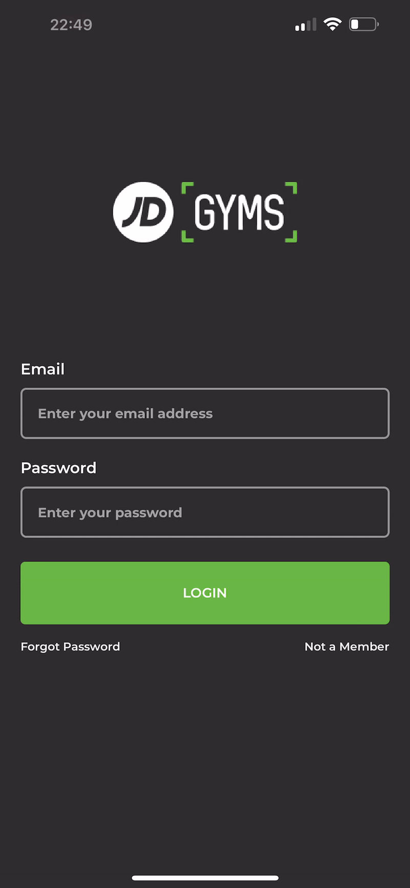
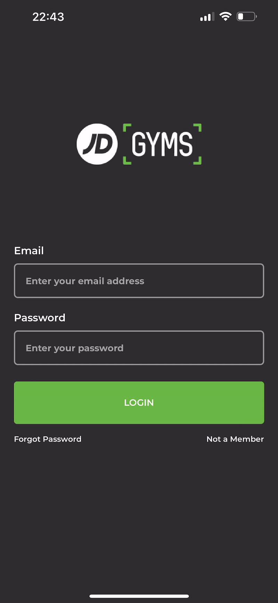
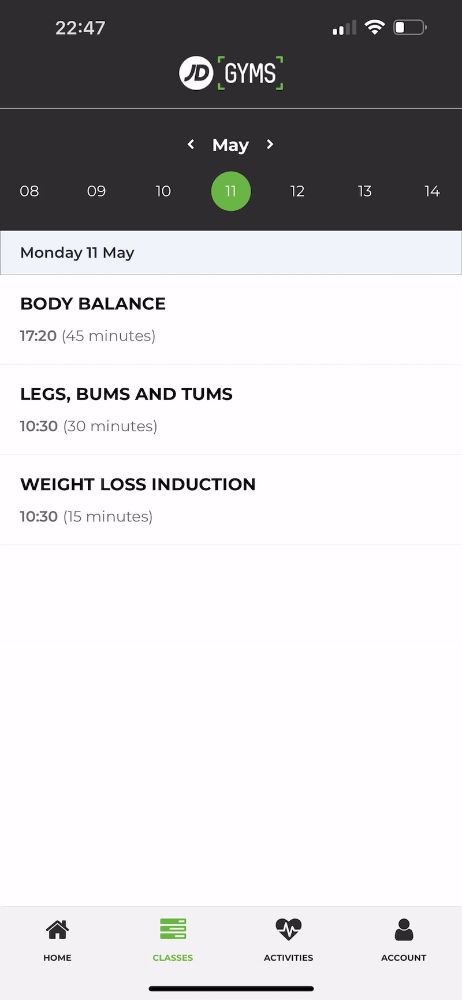

<div>
    <h1 align="center">JD Gym Native App</h1>
    <br/>
    <p align="center">
        An App built with React Native.
        <br />
        <br />
        
        <br />
        <br />
        <br />
    </p>
</div>


# About The Project
JD Gym is a low cost gym chain in the UK which has a mobile app but lacks functionality. I worked with a UI designer, and together we have created an app redesign to help improve the user experience allowing them to book classes and navigate the app easily. Please click this <a href="https://xd.adobe.com/view/c92821ad-effa-4615-7d60-534c34857019-bf19/">link</a> for the UI design.

STATUS: The app's functionality is currently limited but the overall UI design is complete.

### Built With

* React Native
* Firebase
* Expo Go

</br>

### Visuals

Login Path
<br />


<br />
Loging In
<br />


<br />
Account Screen
<br />


<br />
Classes Screen
<br />


<br />
Booking and Canceling Class
<br />

<br />
<br />


<!-- GETTING STARTED -->
## Getting Started

Get the project running on your local server.

### Prerequisites

Install the latest npm version.
* npm
  ```sh
  npm install npm@latest -g
  ```

### Installation

1. Clone the repo
   ```sh
   git clone https://github.com/learsiOtni/jd-gym-native-app.git
   ```
2. Install NPM packages
   ```sh
   npm install
   ```
</br>