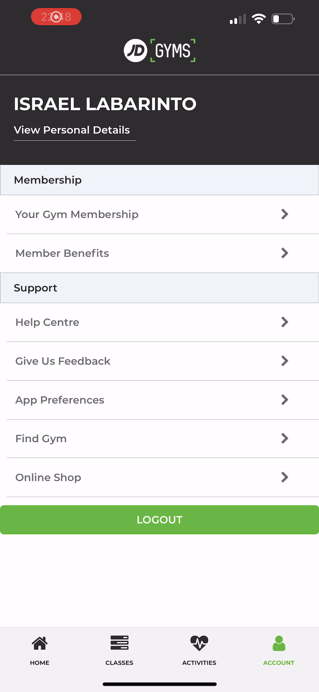

<div>
    <h1 align="center">JD Gym Native App</h1>
    <br/>
    <p align="center">
        A React Native App of the JD Gym.
    </p>

    

</div>


# About The Project
Jd Gym Native App is a redesign of the already exisitng jd gym app. I translated the design linked below into a working prototype.


The app's functionality is currently limited.

### Built With

* React Native
* Firebase

</br>



<!-- GETTING STARTED -->
## Getting Started

Get the project running on your local server.

### Prerequisites

Install the latest npm version.
* npm
  ```sh
  npm install npm@latest -g
  ```

### Installation

1. Clone the repo
   ```sh
   git clone https://github.com/learsiOtni/macro-tracker-web-app
   ```
2. Install NPM packages
   ```sh
   npm install
   ```

